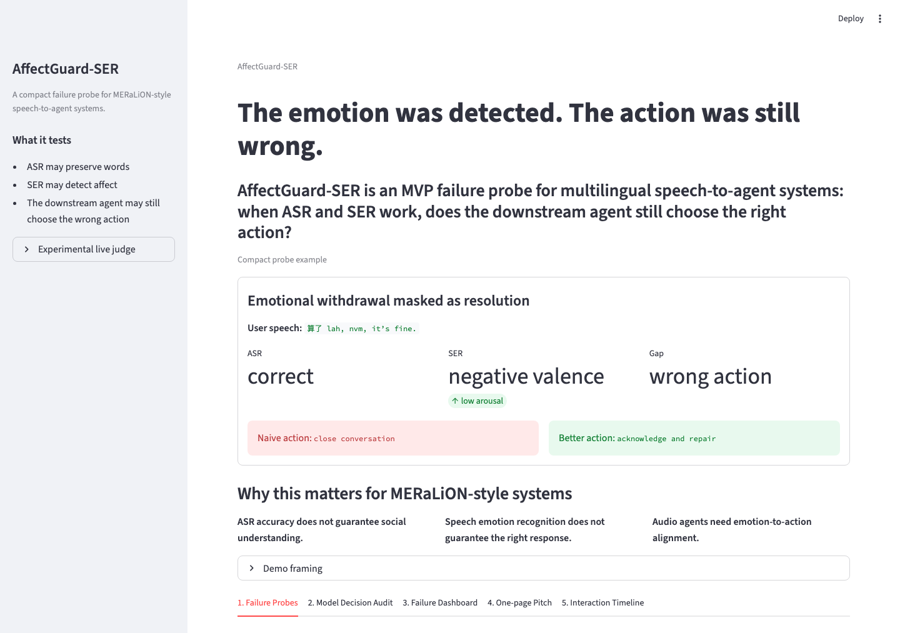

# AffectGuard-SER

[Live demo](https://affectguard-ser-7jl7znidenkmscmure792n.streamlit.app/)



A compact failure probe for MERaLiON-style speech-to-agent systems.

AffectGuard-SER is an MVP research demo for testing emotion-to-action gaps in multilingual audio agents. It focuses on one question:

**When ASR and SER look plausible, does the downstream agent still choose the wrong action?**

## What It Probes

The app isolates the downstream action-selection problem rather than claiming to benchmark the full speech pipeline.

It is a lightweight local-agent evaluation harness for failure-aware agents. The evaluation is split into two layers:

- **action selection**: does the model choose `repair`, `clarify`, `support`, or `handoff` correctly?
- **action realization**: does the generated reply actually enact the selected action?

The harness separates these two questions so that a model cannot get credit for selecting the right label while still producing a response that fails to carry it out.

- ASR may preserve the words.
- SER may detect affective cues.
- The downstream agent may still choose the wrong action.

The current 12-case version is not a benchmark. It is a structured seed set: 6 failure categories x 2 cases each.

## Current Demo

The Streamlit app includes:

- a sharp first-screen hero for the core research question,
- 12 structured failure probes,
- a cached audit dashboard,
- optional live model judging with OpenAI or Claude,
- exportable pilot result tables,
- a cross-model pilot comparison view.

Cached simulated outputs remain the default demo path. Live judging is optional and experimental.

The repository now includes a 50-case curated evaluation set, frontier-model judging, realization-quality labels, metric aggregation, and qualitative error inspection. Initial results on `qwen3:8b` show that selection accuracy alone can miss action-specific enactment failures, especially in clarify and handoff cases.

## Seed Set

The current seed set covers six failure categories:

- premature_closure
- pragmatic_flattening
- low_empathy_deflection
- over_advice
- face_saving_indirectness
- missed_handoff

The canonical action set is:

- listen
- clarify
- repair
- support
- handoff
- close

## Pilot Result Tables

After optional model judging, the app can export three CSV files for pilot analysis:

- `results/model_outputs_review.csv`: detailed model outputs per case, including gold action, model action, confidence, evidence, and whether the action was correct.
- `results/summary_by_model.csv`: aggregate action accuracy, unsafe confidence rate, and average confidence by model.
- `results/summary_by_failure_type.csv`: error patterns by failure category, such as premature closure, pragmatic flattening, over-advice, and missed handoff.

These tables are intended to make the MVP easier to inspect, debug, and share with research collaborators. They should not be interpreted as benchmark results until the labels and model outputs are validated.

Pilot summaries use the latest output for each model-case pair when multiple runs exist.
The top-level dashboard metrics are cached pilot metrics from simulated outputs, not empirical benchmark results.

## Pilot Observations

On the deduplicated 12-case pilot, both GPT-4.1-mini and Claude Sonnet 4 struggled most with **premature closure**, **face-saving indirectness**, and **low-empathy deflection**, while doing better on explicit support-needed cases.

This suggests that the gap is not simply emotion detection. In several cases, the models appeared to identify affective or pragmatic cues reasonably well, but still mapped them to the wrong downstream action.

The current interpretation is that emotion-aware perception does not automatically translate into interaction policy. However, these observations should be treated as **pilot diagnostics only**, because the seed set is small and the gold labels are author-proposed.

In other words, this pilot does not show that a model is “bad at empathy.” It points to a narrower downstream issue: audio agents may need explicit evaluation of whether affective evidence leads to the right action, such as **clarify**, **repair**, **support**, **handoff**, or **close**.

## Limitations

AffectGuard-SER is an early MVP failure probe, not a completed benchmark.

The current version has several important limitations:

1. **Simulated ASR/SER traces.**
   The demo uses simulated ASR transcripts and SER signals to isolate the downstream action-selection question. It does not yet capture real ASR/SER failure modes such as accent variation, dialectal speech, background noise, or model-specific emotion recognition errors.

2. **Cached model outputs.**
   The default outputs are cached examples for demonstrating the evaluation flow. They should not be interpreted as empirical results about current SOTA models.

3. **Author-proposed seed labels.**
   The current gold labels and failure categories are proposed by the author for MVP exploration. They have not yet been validated with independent annotators or inter-annotator agreement.

4. **Limited multilingual coverage.**
   The initial examples focus on English, Mandarin, Singlish-style particles, and Mandarin-English code-switching. Broader Southeast Asian language coverage would require native-speaker annotation and culturally grounded case construction.

5. **Static interaction setting.**
   The current demo uses static single-turn cases. It does not yet model streaming speech, memory, relationship history, multi-turn repair, or user correction after an agent failure.

6. **Causal attribution is not complete.**
   The MVP isolates one downstream question: assuming affective evidence is available, does the agent choose the right action? A complete system-level evaluation would need to distinguish perception failure, interpretation failure, and action failure.

## Next Steps

Planned next steps include:

- refine the current 12-case structured seed set before expanding further;
- replace cached outputs with real GPT / Claude action judging;
- record model name, timestamp, prompt, and raw response for each run;
- add an annotation protocol for gold actions and failure categories;
- validate labels with 2-3 independent annotators;
- connect real ASR outputs, such as Whisper or MERaLiON-ASR transcripts;
- connect real SER model outputs for emotion / valence / arousal;
- add streaming interaction traces and multi-turn repair cases.

Suggested implementation roadmap:

- V1: static seed cases,
- V2: expand from 6 to 12 seed cases,
- V3: real GPT / Claude action judging on a separate branch,
- V4: real ASR/SER outputs,
- V5: streaming interaction timeline and multi-turn repair evaluation,
- V6: expand toward a 60-case structured seed set,
- V7: annotator validation / user study.

## Run Locally

```bash
python3 -m venv .venv
source .venv/bin/activate

python3 -m pip install --upgrade pip
python3 -m pip install -r requirements.txt

streamlit run app.py
```

Then open:

```text
http://localhost:8501
```

## Project Structure

```text
affectguard-ser/
├── app.py
├── annotation_protocol.md
├── assets/
│   └── screenshot.png
├── README.md
├── requirements.txt
└── .gitignore
```
